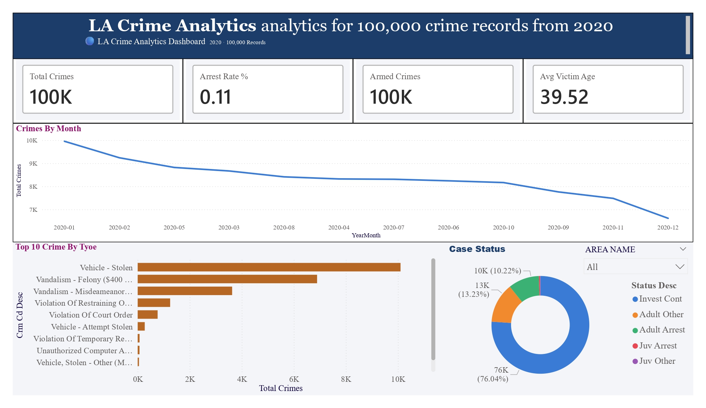
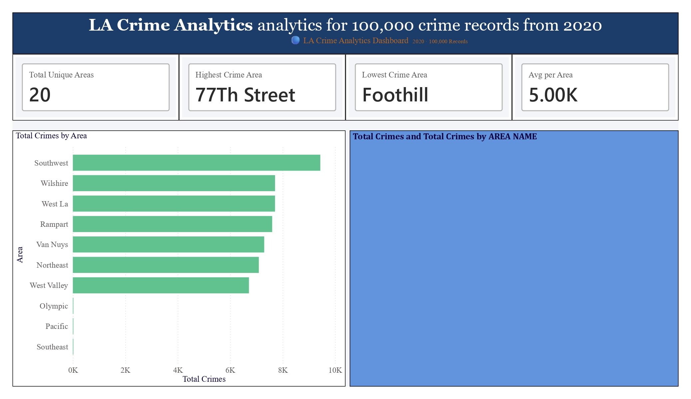
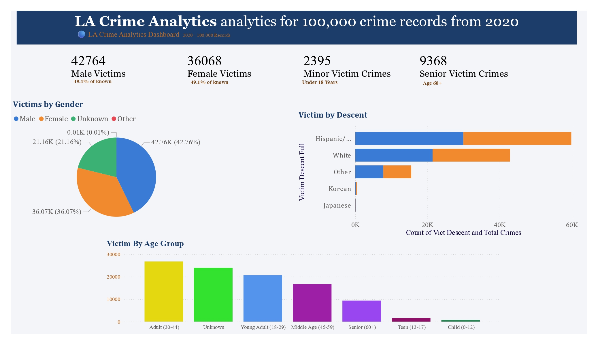
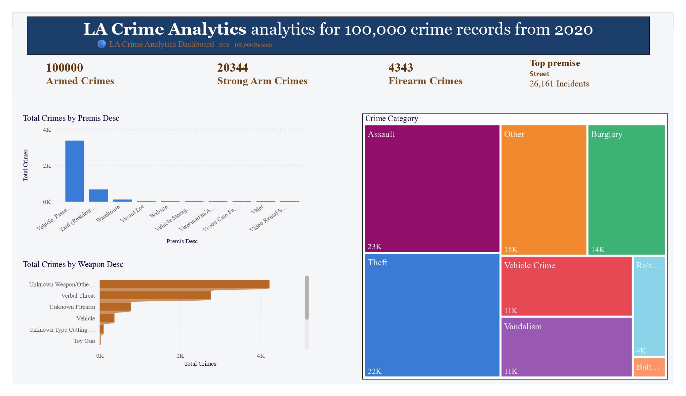
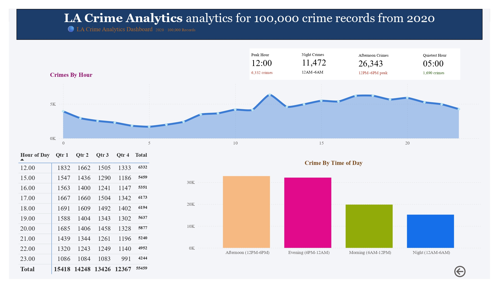

# Crime Data Analysis Power BI Dashboard
## Project Overview
This project analyses Crime data to identify crime trends, patterns, high risk areas, using Excel and Power BI
## Tools Used 
- Microsoft Excel
- Power BI
## Dataset 
- Source: Crime data from 2020 to present
- Data Contains: 
  - Division of Records Number
  - Date Reported
  - Date of Occurrence
  - Time of Occurrence
  - Area Code
  - Area Name
  - Reporting District Number
  - Crime Classification (Part 1 / Part 2)
  - Crime Code
  - Primary Crime Code
  - Crime Description
  - Victim Age
  - Victim Gender
  - Victim Descent
  - Premises Code
  - Premises Description
  - Weapon Description
  - Case Status Code
  - Case Status Description
  - Cross Street
  - Latitude
  - Longitude
  - Crime Location
## Steps Followed 
- Cleaned data in Excel (e.g., removed blanks, formatted columns) 
- Imported cleaned data into Power BI 
- Built dashboards using charts, slicers, and KPIs
## Key Insights 
1. 📉 Very low arrest rate (~11%), with most cases still under investigation.
2. 📍 Crime is concentrated in hotspots, with **77th Street** as the highest crime area.
3. 🚗 Vehicle theft and vandalism are the most common crime types.
4. ⏰ Crimes peak in the afternoon (12PM–6PM), with **12:00 PM** as the busiest hour.
5. 🛣️ Streets are the most frequent crime locations.
## Screenshots 

## Files Included
- ‘Crime Data - Cleaned.xlsx’ – Cleaned data and basic analysis 
- ‘Crime Data -Visualisation.pbix’ – Power BI dashboard 
- ‘README.md’ – Project description